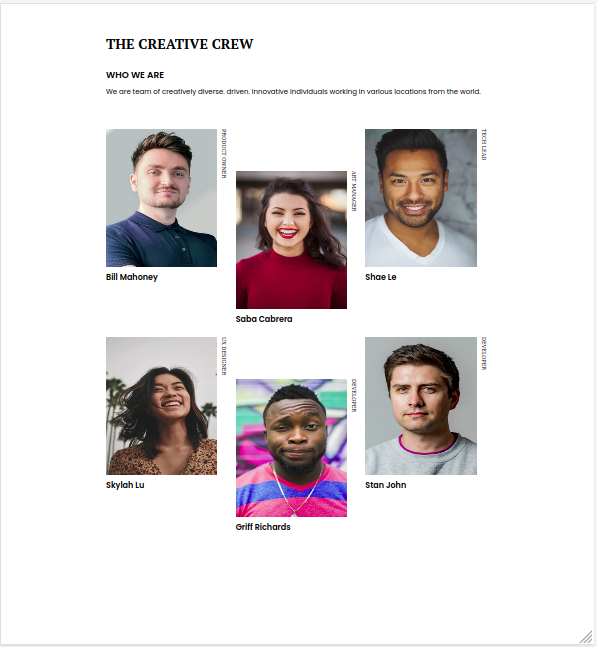
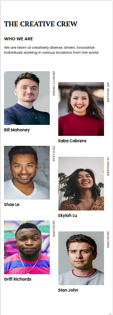

<!-- Please update value in the {}  -->

<h1 align="center">MY TEAM PAGE</h1>

   Solution for a challenge from  <a href="http://devchallenges.io" target="_blank">Devchallenges.io</a>.

  <h3>
    <a href="https://josiashod.github.io/my-team-page/">
      Demo
    </a>
     | 
    <a href="https://github.com/josiashod/my-team-page/">
      Solution
    </a>
     | 
    <a href="https://devchallenges.io/challenges/hhmesazsqgKXrTkYkt0U">
      Challenge
    </a>
  </h3>

<!-- TABLE OF CONTENTS -->

## Table of Contents

- [Overview](#overview)
  - [Built With](#built-with)
- [Features](#features)
- [Contact](#contact)

## Overview

  It was very hard to make the vertical post component. I've almost given up but finally i saw my mistake and i improve my skills 

### Built With

- HTML5
- CSS3

## Features

This page was created as a submission to a [DevChallenges](https://devchallenges.io/challenges) challenge. The [challenge](https://devchallenges.io/challenges/hhmesazsqgKXrTkYkt0U) was to build a team page.

## Contact

- GitHub [@josiashod](https://github.com/josiashod)
- Twitter [@josias_hod](https://twitter.com/josias_hod)
